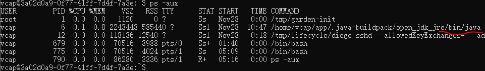
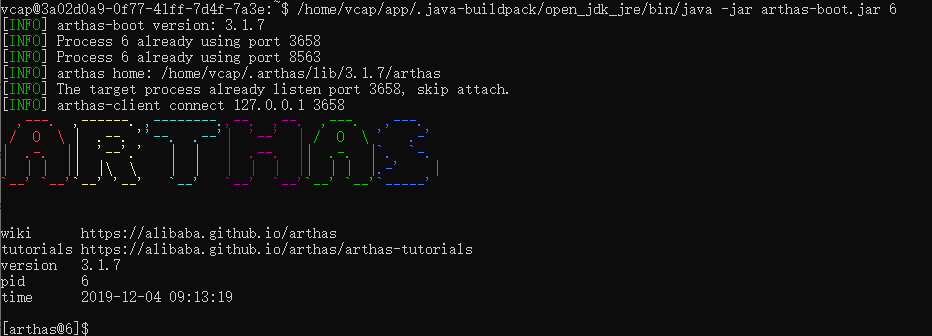

# Using Arthas to Dianosticate Application Running in Cloud Foundry.

Arthas is an open source tool contributed by Alibaba, it is a rich toolset that assist software development and operation team to trouble shooting in running environment.

### Arthas Official Document
[Github Project](https://github.com/alibaba/arthas)  
[Documentation](https://alibaba.github.io/arthas/)

### What Arthas can do for us
I only focus on necessarity of our applications, for complete description of Arthas' power, please refer to its [command list](https://alibaba.github.io/arthas/commands.html).
1. Check JVM resource situation
2. Threads situation, who blocks who
3. Which method is running currently (for a long time already) by a thread
4. How my method is called (by what import parameters, what output and what exception happens)
5. De-compile one of my class to verify if it is the one expected to run
6. Monitor the system or my class/method specifically for a while, like SE30 in ABAP
7. ... 

### Using Arthas on Application Running in Cloud Foundry

Let's see how to setup Arthas on Cloud Foundry container (in which my application is running), then play around some of its commands)

**Step 0: Prerequisites**  
1. Our application is SSH enabled. That needs 'Operator', 'Space Manager' and 'Space Developer' all say 'ok', [detail here](https://docs.cloudfoundry.org/devguide/deploy-apps/app-ssh-overview.html).
2. You are member of the cloud account and the target space in that account. how to verify: try "cf login" to go through the logon process.

**Step 1: Login app container via SSH**  
```
cf ssh projectDashboardService
```
If you login successfully, you will see linux-style command sign '$', you locate at your home and you can verify by command 'ls'.

**Step 2: Download Arthas**  
According to Arthas installation guide, we can get it by this command:
```
curl -O https://alibaba.github.io/arthas/arthas-boot.jar
```
Above command will download arthas into your home page, use command 'ls' to verify, you should see 'arthas-boot.jar' in the result.

**Step 3: Start Arthas**  
Firstly you need to find out process ID of your jvm in the container:
```
ps -aux
```
record the PID of java process, it is 6 for my case below:  

 
Above result also tell us which is your java command locates. In Cloud Foundry container, if you run command 'java' in command line, the system will told you it is invalid command, but we know java is installed indeed otherwise how our web server (tomcat) be ran? we need to find java location firstly, actually above result provides us hints, it is "/home/vcap/app/.java-buildpack/open_jdk_jre/bin/java" for my case.

With all of these information, we are ready to start Arthas, for my case:  
```
/home/vcap/app/.java-buildpack/open_jdk_jre/bin/java -jar arthas-boot.jar 6
```  
Result likes this:  


The start command 'attaches' Arthas to the JVM process where our tomcat is running on, then Arthas can interact with that JVM later.

**Step 4: Play around Arthas Commands**
  