# Using Arthas to Dianosticate Application Running in Cloud Foundry.

Arthas is an open source tool contributed by Alibaba, it is a rich toolset that assist software development and operation team to trouble shooting in running environment.

>Since Arthas is open source application and most likely we need to deploy it to the target environment (dev, qas or prd) to use it, it maybe a concern from security point of view. So be careful, you need to remove it from your environment after finishing trouble shooting work. Command to remove Arthas (in Linux):  
```  
rm -rf ~/.arthas/  
rm -rf ~/logs/arthas  
``` 


### Arthas Official Document
[Github Project](https://github.com/alibaba/arthas)  
[Documentation](https://alibaba.github.io/arthas/)

### What Arthas can do for us
I only focus on necessarity of our applications, for complete description of Arthas' power, please refer to its [command list](https://alibaba.github.io/arthas/commands.html).
1. Check JVM resource situation
2. Threads situation, who blocks who
3. Which method is running currently (for a long time already) by a thread
4. How my method is called (by what import parameters, what output and what exception happens)
5. De-compile one of my class to verify if it is the one expected to run
6. Monitor the system or my class/method specifically for a while, like SE30 in ABAP
7. ... 

### Using Arthas on Application Running in Cloud Foundry

Let's see how to setup Arthas on Cloud Foundry container (in which my application is running), then play around some of its commands)

**Step 0: Prerequisites**  
1. Our application is SSH enabled. That needs 'Operator', 'Space Manager' and 'Space Developer' all say 'ok', [detail here](https://docs.cloudfoundry.org/devguide/deploy-apps/app-ssh-overview.html).
2. You are member of the cloud account and the target space in that account. how to verify: try "cf login" to go through the logon process.

**Step 1: Login app container via SSH**  
 
```  
cf ssh <here is your app name in cloud foundry>
```   
If you login successfully, you will see linux-style command sign '$', you locate at your home and you can verify by command 'ls'.

**Step 2: Download Arthas**  
According to Arthas installation guide, we can get it by this command:
```  
curl -O https://alibaba.github.io/arthas/arthas-boot.jar
```    
Above command will download arthas into your home page, use command 'ls' to verify, you should see 'arthas-boot.jar' in the result.

**Step 3: Start Arthas**  
Firstly you need to find out process ID of your jvm in the container:
```  
ps -aux
```  
record the PID of java process, it is 6 for my case below:  

 
Above result also tell us which is your java command locates. In Cloud Foundry container, if you run command 'java' in command line, the system will told you it is invalid command, but we know java is installed indeed otherwise how our web server (tomcat) be ran? we need to find java location firstly, actually above result provides us hints, it is "/home/vcap/app/.java-buildpack/open_jdk_jre/bin/java" for my case.

With all of these information, we are ready to start Arthas, for my case:  
```  
/home/vcap/app/.java-buildpack/open_jdk_jre/bin/java -jar arthas-boot.jar 6
```    
Result likes this:  
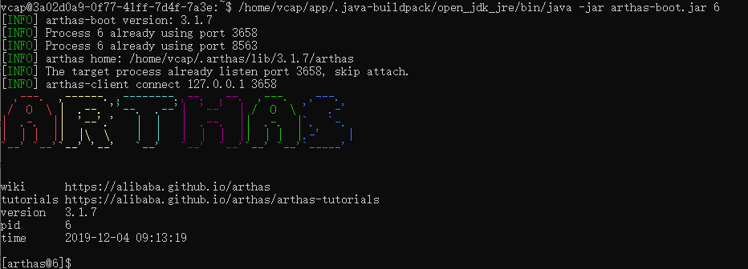

The start command 'attaches' Arthas to the JVM process where our tomcat is running on, then Arthas can interact with that JVM later.

**Step 4: Play around Arthas Commands**

**Case 1**: JVM overview  
```  
dashboard
```  
Use 'Ctrl + C' to exit from the command

Result:  
It provides high level overview of JVM assets  
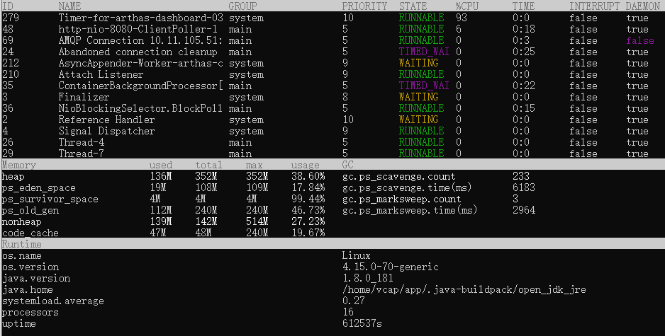

**Case 2**: Which thread block mine?  
```  
thread -b
```  
if we remove the parameter 'b', then all threads are listed

Result:  
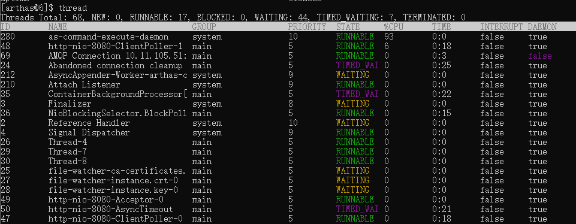

**Case 3**: show system environment variables  
```  
sysenv  
```  

Result:  
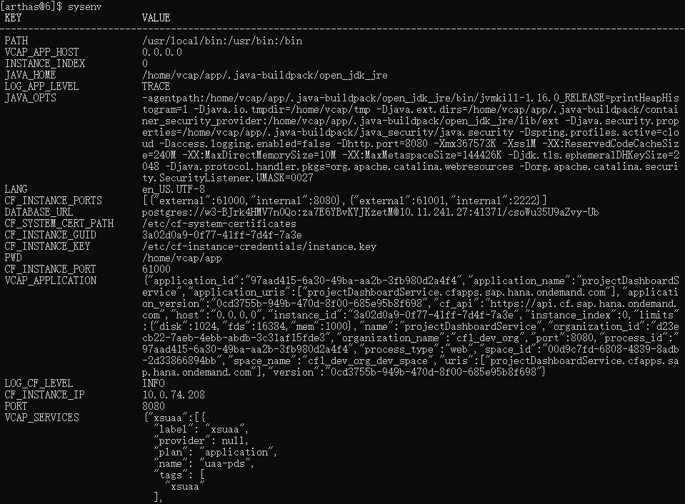

**Case 4**: How many times is my method called? Is it run successfully?  
```  
monitor -c 5 com.sap.solman.projectDashboardService.controller.DefaultController ApiV1GetJWTToken
```  
parameter 'c' told Arthas monitor the JVM and show count number per 5 seconds

Result:  
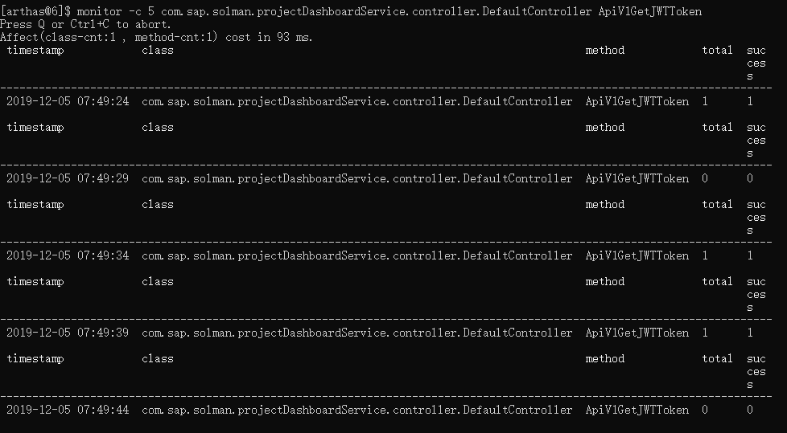 

**Case 5**: How is my method called? by which parameters and what's the output?  
```  
watch  com.sap.solman.projectDashboardService.controller.DefaultController  ApiV1GetJWTToken "{params,returnObj}"  
```  
command watch is powerful and useful, it contains a lot of parameters, please refer the official document for a complete parameter list

Result:  
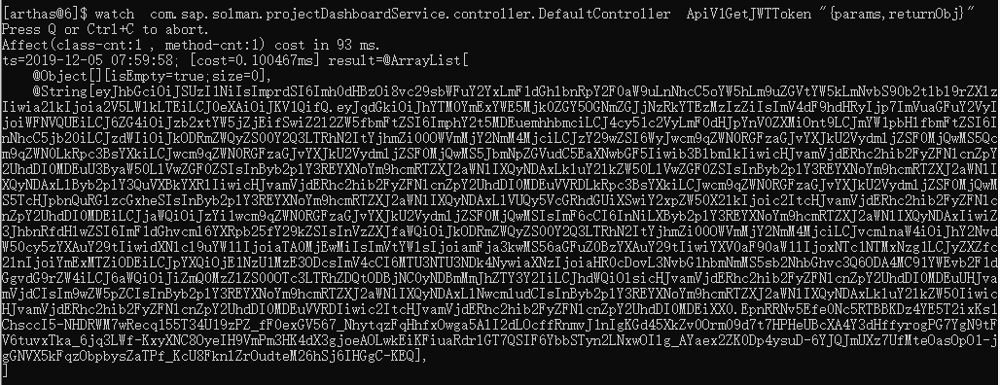

**Case 5**: What's the difference between different call on my method? are import parameters different? are output different?
Firstly let's start to record calls on the target method:  
```  
tt -t com.sap.solman.projectDashboardService.controller.DefaultController  ApiV1GetJWTToken  
```  
Then trigger the calls on this method, by your ways. When it is done please store the tt by 'Ctrl+C'. Results may like this:  
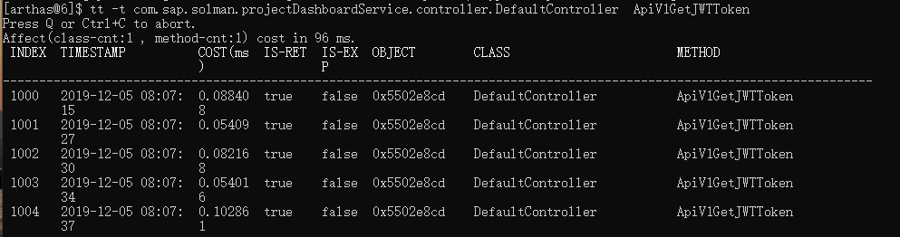

Now let's check records we got by previous trace:  
```  
tt -l  
```     
Results like this:  
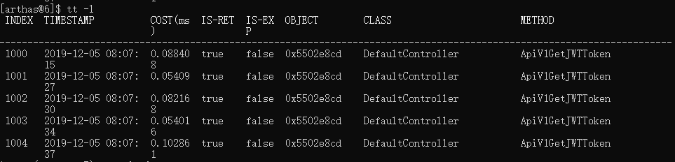

Now let's look into detail of record 1000:  
```  
tt -i 1000  
```  
Results:  
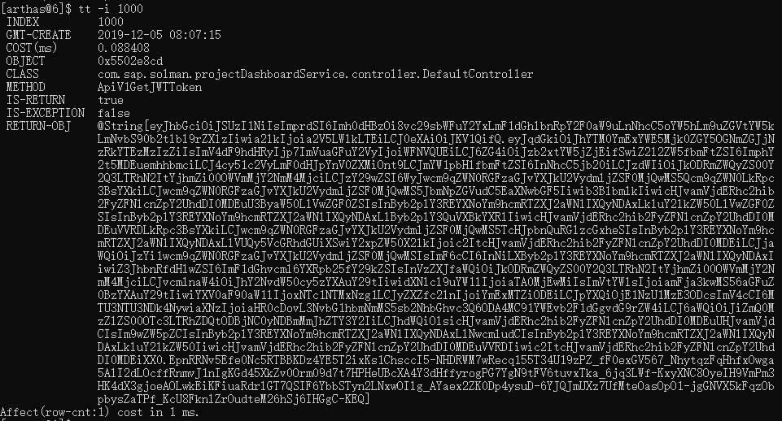

**Case 6**: One of my method is slow, what sub method call causes this problem? may I check the time spent on each method call?    
Firstly start the trace on this method:  
```  
trace com.sap.solman.projectDashboardService.controller.DefaultController ApiV1GetJWTToken  
```  
Then trigger the method call and stop the trace by 'Ctrl+C', result likes this:  
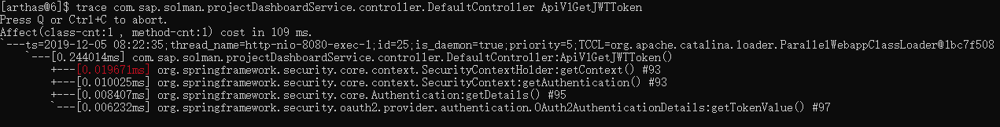  

There are many options to filter trace target, check the offical document for detail.

**Case 7**: What is my method call stack?    
Firstly start the trace on this method:  
```  
stack com.sap.solman.projectDashboardService.controller.DefaultController ApiV1GetJWTToken  
```  
Then trigger the method call and stop the trace by 'Ctrl+C', result likes this:  
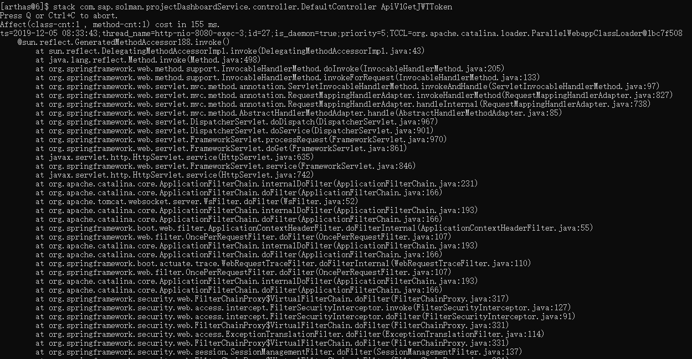    
  
There are many options to filter trace target, check the offical document for detail..  

**Step 4: Exit Arthas and clear the environment**  
Arthas needs to "enhance" some production classes to finish its monitor work, so it would be a good idea to clean these before we leave it. The command is:  
```  
reset  
```  
According to Arthas document, this will remove all Arthas enhancements on our classes, our production codes and JVM should back to normal.   