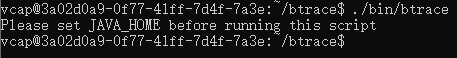
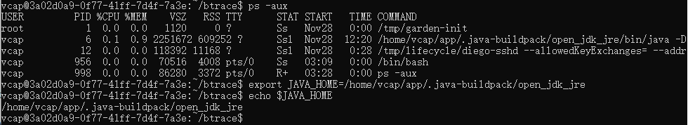
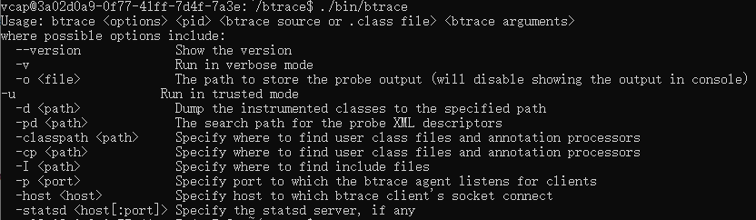
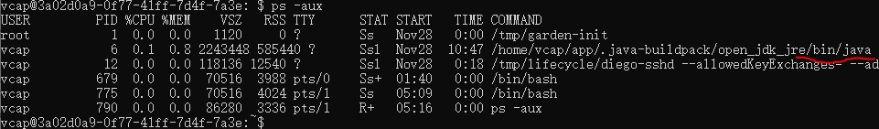
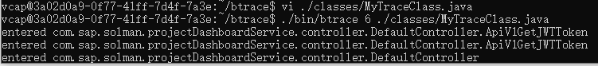

# Using BTrace to Dianosticate Application Running in Cloud Foundry.

BTrace is a pretty old tool of trouble shooting running java application, it was introduced by Sun at 2007. It claims itself as 'safe and simple', with BTrace's help we can detect root cause while the application is running.
> 1. One thing we have to remember, after we inject codes to classes running in JVM, the injected codes will be there until the application is restarted, that can be a performance concern: although the codes will not be ran if we exit BTrace, but JVM will check if to run the codes anyway. So we'd better be careful to use BTrace.  
> 2. Another point we need to remind ourselves is that, BTrace can break down the application if bad quality trace codes are used.
 
### BTrace Official Document
[Github Project](https://github.com/btraceio/btrace)  
[User Guide](https://github.com/btraceio/btrace/wiki)
[Annotations in Trace Codes](https://github.com/btraceio/btrace/wiki/BTrace-Annotations)

### What BTrace can do for us  
BTrace runs your tracing-purpose-codes when the defined conditions (by you) are fulfilled, it will supply 'context' - like parameters values which are used to the target method - to your trace codes so that you can print them into standard output. As developer you are very flexible regarding what to monitor.  

BTrace injects tracing-purpose-codes to target class (no matter provided by jdk or your own application), the codes will be ran to let you print helpful information. It works like AOP. As developer you need to write tracing codes,define when the codes will be ran, then ask BTrace to inject them to the target Java process.  
   
Think about this situation: you have an application, you find it will delete one important file periodically but you have no idea why that happen. Then one solution by BTrace is that you inject stack printing codes to delete-method of java.io.File class to record call-stack when deleting happen.

### Using BTrace on Application Running in Cloud Foundry  

**Step 0: Prerequisites**  

1. Our application is SSH enabled. That needs 'Operator', 'Space Manager' and 'Space Developer' all say 'ok', [detail here](https://docs.cloudfoundry.org/devguide/deploy-apps/app-ssh-overview.html).
2. You are member of the cloud account and the target space in that account. how to verify: try "cf login" to go through the logon process.

**Step 1: Login app container via SSH**  
 
```  
cf ssh <here is your app name in cloud foundry>
```   
If you login successfully, you will see linux-style command sign '$', you locate at your home and you can verify by command 'ls'.

**Step 2: Download and Setup BTrace**  

I create one folder to contain BTrace assets centrall:
```
mkdir btrace  
cd btrace  
```

In BTrace [release page](https://github.com/btraceio/btrace/releases/), you can find all available releases, identify url of the one you want to download, I select version 1.3.11.3, then 
```  
wget https://github.com/btraceio/btrace/releases/download/v1.3.11.3/btrace-bin-1.3.11.3.tgz  
```  
After done load is done, unzip the tgz file by:  
```  
tar -zxf btrace-bin-1.3.11.3.tgz
```  

If we try to run btrace now, we will see a problem:  
  

Because in cloud foundry container, JAVA_HOME variable isn't set, let's add a temparary env variable :  
  

Now let's try to call btrace without any parameters, we are success if we see this:  

 
**Step 3: Create Trace Codes**  

BTrace codes should be putted into a class' static method, you can't use all elements provided by java language, there are some restrictions to avoid huge damage, if you want to learn all the restrictions, see detail in [this page](https://github.com/btraceio/btrace/wiki/Trace-Scripts#restrictions) of its offical website.

Let's create class MyBTraceClass:  
```  
mkdir classes    
touch .classes/MyTraceClass.java
vi MyBTraceClass.java
```  

here is my test trace class:  
```java  
package classes;

import com.sun.btrace.annotations.*;
import static com.sun.btrace.BTraceUtils.*;

/**
 * This script traces method entry into every method of 
 * every class in com.sap.solman.projectDashboardService.controller!
 */
@BTrace public class MyBTraceClass {
    @OnMethod(
        clazz="/com\\.sap\\.solman\\.projectDashboardService\\.controller\\..*/",
        method="/.*/"
    )
    public static void m(@ProbeClassName String probeClass, @ProbeMethodName String probeMethod) {
        print(Strings.strcat("entered ", probeClass));
        println(Strings.strcat(".", probeMethod));
    }
} 
```  

This method simplely print information when method of my controller classes under a package is called. You can imagine there are many other possibilities beside print. 

@Method annotation is a well known one in BTrace, it will define which class's which method will be monitored at a point of time (begin of method call or end, or an event happen). If you want to see other [annotations beside @Method, go to this page](https://github.com/btraceio/btrace/wiki/BTrace-Annotations).  

**Step 4: Run BTrace to Inject the Trace Codes**  

Like Arthas, BTrace needs you provide jvm process id to monitor, so you need to find the PID firstly. command ```ps -aux ``` can be used for that:  
  

So the process id is 6 for my case. Now it is time to start BTrace with my trace codes:  
```  
./bin/btrace 6 ./classes/MyTraceClass.java
```  
You will see the command takes you into running mode, it will not exit until you hit 'Ctrl+C', don't do that until you finish trace work.  

After trigge method calls some times, we can see out put of our trace:  


**Step 5: Exit BTrace**  
Hit 'Ctrl+C' to exit from running mode and back to command line.